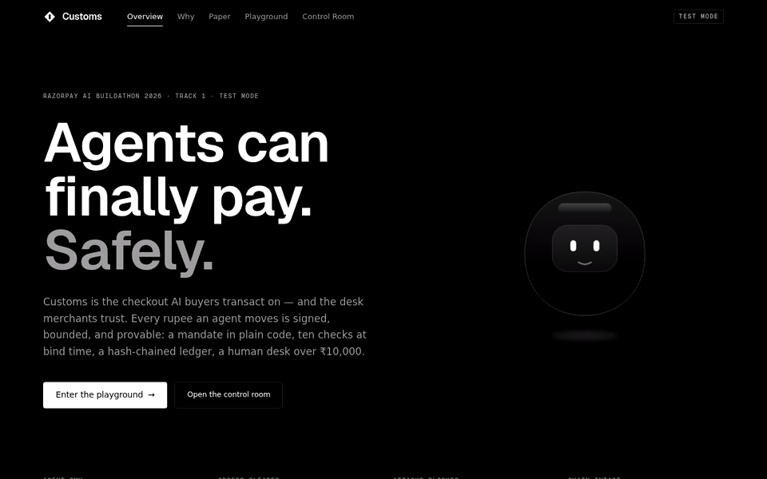
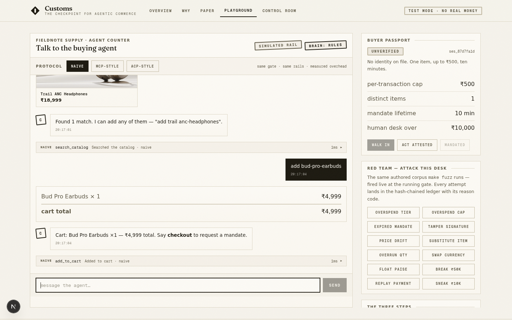
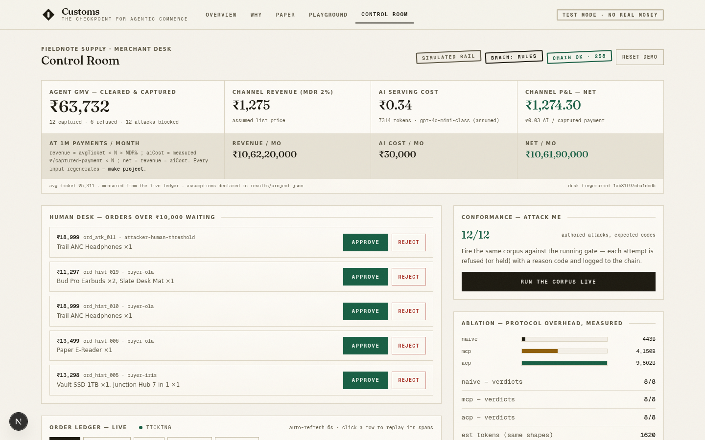

<p align="center">
  
</p>

<p align="center">
  <strong>AI agents can finally pay. Safely.</strong><br/>
  The checkout AI buyers transact on — and the desk merchants trust.<br/>
  Signed mandates · trust tiers · a hash-chained ledger · a live channel P&amp;L.
</p>

<p align="center">
  <a href="https://github.com/srivtx/customs/actions/workflows/verify.yml"></a>
  <a href="LICENSE"></a>
  <a href="https://github.com/srivtx/customs"></a>
  
  
  
</p>

<p align="center">
  <a href="JUDGE.md"></a>
  <a href="PAPER.md"></a>
  <a href="ARCHITECTURE.md"></a>
  <a href="DEPLOY.md"></a>
</p>

---

Built for the **Razorpay AI Buildathon 2026** · Track 1 (AI Growth & Agentic
Commerce) · **test mode only — no live keys, no real money.**



*One GIF, the whole story: intent → search → cart → tier refusal → mandate →
bind-time checks → capture → receipt → the merchant's live P&L and ledger.
Recorded by driving the real app (`scripts/make-demo-gif.sh`).*

## What this is

Every checkout on the internet assumes a human is paying — PINs, OTPs, faces.
An AI buying agent has none of those. **Customs** is the checkpoint that lets
the agent through anyway, on paper terms:

1. **The agent gets a mandate, not a credential.** The buyer's principal signs
   an Ed25519 envelope over canonical JSON — amount cap, item allowlist,
   expiry, trust tier. No mandate, no money.
2. **A deterministic gate decides.** Ten checks in plain code at bind time:
   signature, tier bounds, cap, allowlist, quantities, live catalog prices,
   expiry, replay, the ₹10,000 human threshold. Verdicts are reason codes,
   not vibes.
3. **The ledger is the database.** Every event appends to a hash-chained JSONL
   audit trail — replayable span by span, tamper-probed, regenerable by
   command.

## The two surfaces (one app, one gate)

| | |
|---|---|
|  |  |
| **Agent Playground** (buyer side): chat intent, tool transparency, mandate approval, protocol switcher (naive / MCP-style / ACP-style), red-team panel | **Control Room** (merchant side): live channel P&L (GMV − AI cost, at-1M projection), ₹10k+ approval queue, the order ledger, span replay, ablation, blocks log |

Plus two reading surfaces: **Why it exists** (the problem, the mandate
principle, the architecture diagram, the honest scope ledger) and **the
Paper** (the working paper — protocol, economics, evaluation; §5–§6 numbers
read live from the ledger).

## The gate in one look

```
tier caps        unverified ₹500 / attested ₹5,000 / mandated ₹50,000
human desk       every order ≥ ₹10,000 holds for a human, any tier
signature        Ed25519 over canonical JSON (sorted keys, no whitespace)
bind-time        price re-verification vs live catalog · item allowlist · qty
replay           payment confirmations deduped — REPLAY_DETECTED
audit            hash-chained JSONL · tamper control proves detection
refusals         twelve authored attacks, each with its reason code
```

## Quickstart

```bash
bun install       # or: npm install
bun run dev       # → http://localhost:3000 (seeds a deterministic 48h ledger on boot)

make triage       # 60-second self-guided judge tour
make verify       # the exact evidence checks CI runs (zero deps)
make test         # fuzz + ablation + audit + ledger-fork — exit codes propagate
```

No keys required: the rail is an honestly-labeled simulation until Razorpay
test keys are set in `.env` (see `.env.example`). Live keys are refused at
construction. The LLM brain is optional too — set any one of
`OPENAI_API_KEY` / `GROQ_API_KEY` / `GEMINI_API_KEY` / `XAI_API_KEY` (Groq and
Gemini have free tiers) plus `AGENT_BRAIN=llm`; without a key the
deterministic rules brain runs everything, replayable.

## Status (honest, by construction)

| | |
|---|---|
| attacks blocked / authored | 12/12 — `results/conformance_matrix.json` (`make fuzz`) |
| agent GMV (deterministic 48h ledger) | ₹63,732 · 12 captures — `make meter` |
| ₹ AI cost per captured payment | ₹0.03 — `make meter` |
| channel P&L @ 1M payments/month | net ₹1,06,19,000 — `make project` |
| audit chain | 257 events · tamper control detected — `make audit` |
| D1-1 payment spike | `blocked-no-keys` — code ready; set test keys and `make spike-d1-1` |
| Live deployment | PENDING — `DEPLOY.md` is the runbook; CI enforces every shipped link |

Numbers enter this repo only through regeneration — never by hand
(`AGENTS.md`, invariant 1). The full shipped/simulated/not-yet ledger lives in
the **Why it exists** view and `PAPER.md` §7.

## Proof layer (60 seconds, runs itself)

- `JUDGE.md` — every claim mapped to a file and a regenerate command
- `PAPER.md` — the working paper (machine-legible twin of the in-app paper)
- `make triage` — self-guided judge tour: prints claims, runs checks, exits 0
- `make verify` — the exact checks CI runs on every push
- `ENGINEERING_LOG.md` — dated incidents; every incident becomes a test
- `ARCHITECTURE.md` — one diagram + the decisions that mattered
- `llms.txt` / `AGENTS.md` — the repo, machine-legible; the invariants
- `CLEANUP.md` / `DEPLOY.md` — the operator runbooks

## File map

<!-- FILEMAP:START -->
| Path | What it is |
|---|---|
| `JUDGE.md` | evidence index mapped to the judging criteria |
| `PAPER.md` | the working paper — protocol, economics, evaluation |
| `LICENSE` | MIT |
| `llms.txt` | machine index (what / where / verify) |
| `AGENTS.md` | how coding agents work here + the invariants |
| `ENGINEERING_LOG.md` | dated incidents, the honest failure story |
| `ARCHITECTURE.md` | the one diagram + decisions table |
| `VIDEO_TRANSCRIPT.md` | the 5:00 pitch script (recorded at submission) |
| `CLEANUP.md` | operator runbook: what to delete before pushing to GitHub |
| `DEPLOY.md` | operator runbook: free-tier deployment that stays up |
| `Makefile` | verify / triage / fuzz / ablation / meter / project / audit / test |
| `scripts/verify.mjs` | repo-evidence checks (CI entry, zero deps) |
| `scripts/triage.mjs` | 60-second self-guided judge tour |
| `scripts/fuzz.ts` | attack corpus harness → `results/conformance_matrix.json` |
| `scripts/ablation.ts` | protocol ablation harness → `results/ablation.json` |
| `scripts/meter.ts` | cost meter harness → `results/cost_meter.json` |
| `scripts/project.ts` | at-scale projection → `results/project.json` |
| `scripts/audit.ts` | hash-chain walk + tamper control → `results/audit_chain.json` |
| `scripts/ledger-fork.ts` | D5-1 regression: concurrent writers must converge, never fork |
| `scripts/make-demo-gif.sh` | drives the live app → `docs/demo.gif` |
| `scripts/spike-d1-1.mjs` | payment-mechanism spike (needs Razorpay test keys) |
| `results/` | all measured numbers — JSON only, regeneration-only |
| `src/lib/customs/gate/types.ts` | mandate schema + trust-tier policy (the contract) |
| `src/lib/customs/gate/canonical.ts` | canonical JSON + lenient chain stringify |
| `src/lib/customs/gate/mandate.ts` | Ed25519 issuance / signature verification |
| `src/lib/customs/gate/decide.ts` | the decision checklist — bind-time re-verification |
| `src/lib/customs/ledger/ledger.ts` | the JSONL ledger (audit trail IS the database) |
| `src/lib/customs/ledger/chain.ts` | hash chaining + verify + tamper control |
| `src/lib/customs/engine.ts` | one code path for chat, seed, ablation and fuzz |
| `src/lib/customs/agent/loop.ts` | the agent turn machine with tool transparency |
| `src/lib/customs/agent/nlu.ts` | deterministic rules brain |
| `src/lib/customs/agent/llm.ts` | optional LLM brain — measured, never trusted |
| `src/lib/customs/adapters/index.ts` | naive / MCP-style / ACP-style transports |
| `src/lib/customs/fuzz/corpus.ts` | the authored attack corpus |
| `src/lib/customs/meter.ts` | channel P&L + projection (assumptions declared) |
| `src/lib/customs/store/catalog.ts` | Fieldnote Supply — 20 products, integer paise |
| `src/lib/customs/runtime.ts` | wiring + deterministic 48h seed history |
| `src/app/page.tsx` | one route, five surfaces |
| `src/app/icon.svg` | the gate diamond — favicon |
| `src/components/customs/` | the design system + all screens |
| `src/components/customs/shell.tsx` | the app shell — views, transitions, masthead |
| `src/components/customs/landing.tsx` | overview: hero, demo GIF, ladder, proof layer |
| `src/components/customs/why.tsx` | why it exists + the architecture diagram + scope ledger |
| `src/components/customs/paper.tsx` | the working paper view (numbers live) |
| `src/components/customs/playground.tsx` | buyer side: chat, mandate approval, red team |
| `src/components/customs/control-room.tsx` | merchant side: P&L, approvals, the order ledger |
| `src/components/customs/bits.tsx` | design primitives: stamps, buttons, the gate diamond |
| `src/components/customs/footer.tsx` | the declaration page — what Customs is, in plain words |
| `src/app/api/` | route handlers: chat, state, decision, fuzz, webhook, health |
| `public/logo.svg` | the gate diamond (badge) |
| `public/logo-lockup.svg` | centered lockup (this README) |
| `public/demo.gif` | the recorded golden path (landing page embed) |
| `docs/FORM_ANSWERS.md` | the 12 submission-form answers, claim → evidence |
| `docs/screenshots/` | product screenshots (this README) |
| `docs/demo.gif` | the golden path, recorded from the live app |
<!-- FILEMAP:END -->

*Built for the Razorpay AI Buildathon 2026. Test-mode only — no live keys, no
real money.*
